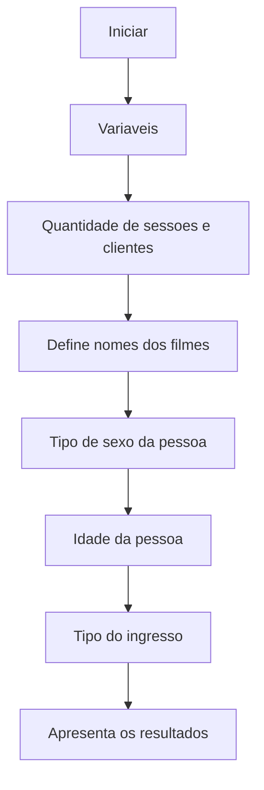

# Projeto_Cinema_Avaliacao_1Semestr

## Fluxograma do Codigo :thread:

```mermaid
graph TB;

A[Iniciar]-->B[Variaveis]
B-->C[Quantidade de sessoes e clientes]
C-->D[Define nomes dos filmes]
D-->E[Tipo de sexo da pessoa]

E-->F[Idade da pessoa]
F-->G[Tipo do ingresso]
G-->H[Apresenta os resultados]

```
